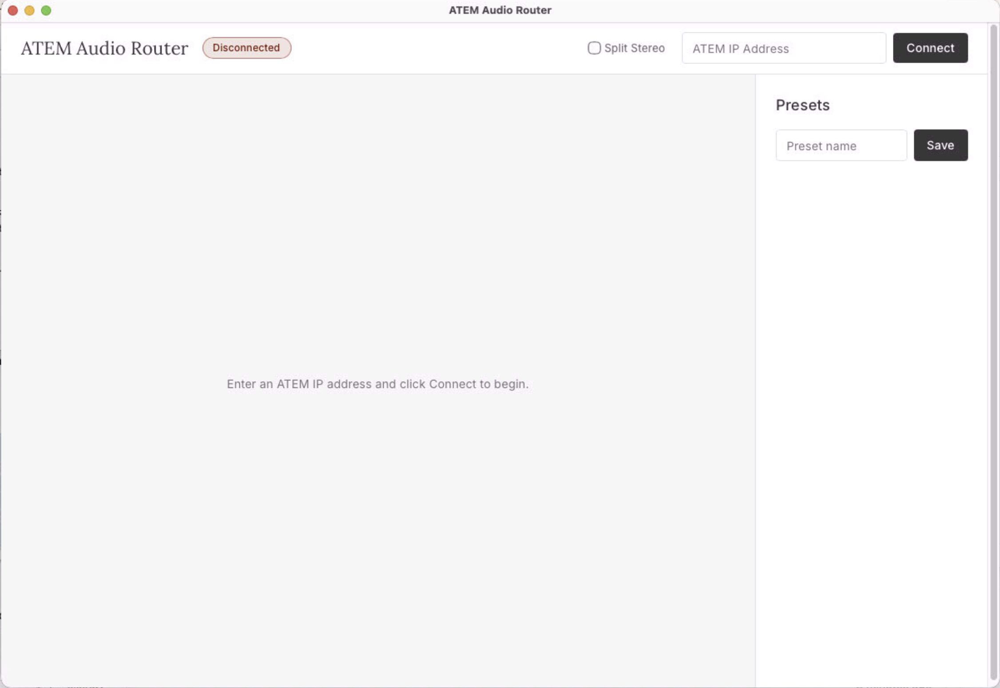

# ATEM Audio Router

Real-time audio routing matrix for Blackmagic ATEM Constellation switchers. Monitor and change Fairlight audio routes through a native desktop crosspoint UI with preset save/recall.



## Requirements

- **ATEM Constellation** series switcher (HD, 4K, or 8K) with **firmware 9.4+**

## Install

Download the latest DMG from [Releases](https://github.com/TomsFaire/Atem-Audio-router/releases).

Since the app is not code-signed, macOS will block it on first launch. After copying to Applications, run:

```bash
xattr -cr "/Applications/ATEM Audio Router.app"
```

Then open the app normally.

## Usage

1. Enter your ATEM's IP address in the top-right field and click **Connect**
2. The crosspoint matrix populates with all available audio sources (rows) and outputs (columns)
3. Click any crosspoint cell to route that source to that output — active routes show as green dots
4. Hover over a cell to highlight the full row and column

### Presets

- Type a name in the Presets panel and click **Save** to snapshot the current routing state
- Click **Recall** on any saved preset to restore that routing configuration
- Only routes that differ from the current state are changed on recall

### Split Stereo

Check **Split Stereo** in the header to automatically split all stereo audio inputs into dual mono channels on connect. This sets every Fairlight input that supports it to `DualMono` configuration, giving you individual control over each channel in the routing matrix.

## HTTP API / External Control

The app runs an HTTP API on port **4000** for integration with Q-SYS, Crestron, or any control system that can make HTTP requests.

| Method | Endpoint | Description |
|--------|----------|-------------|
| `GET` | `/api/state` | Full routing state |
| `POST` | `/api/route` | Set a route — `{"outputId": ..., "sourceId": ...}` |
| `GET` | `/api/presets` | List saved presets |
| `POST` | `/api/preset/recall` | Recall a preset — `{"name": "..."}` |
| `POST` | `/api/preset/save` | Save current state — `{"name": "..."}` |
| `DELETE` | `/api/preset/:name` | Delete a preset |
| `POST` | `/api/connect` | Connect to ATEM — `{"ip": "..."}` |

See [docs/http-api.md](docs/http-api.md) for full documentation with Q-SYS Lua examples and curl commands.

## Architecture

The app is built with [Electrobun](https://github.com/blackboardsh/electrobun) — a lightweight desktop framework using the Bun runtime and system webview. The entire application bundles to ~17MB.

```
┌──────────────────────────────────────────┐
│           Electrobun App (~17MB)         │
│                                         │
│  ┌─────────────┐   RPC   ┌───────────┐ │
│  │ Bun Process  │◄───────►│  Webview  │ │
│  │              │         │           │ │
│  │  core.ts     │         │ Matrix UI │ │
│  │  (ATEM conn, │         │ Presets   │ │
│  │   presets,   │         │           │ │
│  │   state)     │         │           │ │
│  └──────┬───────┘         └───────────┘ │
│         │                               │
│    UDP 9910                             │
│         │                               │
└─────────┼───────────────────────────────┘
          │
    [ATEM Switcher]
```

The **Bun process** owns the ATEM connection (via [`atem-connection`](https://www.npmjs.com/package/atem-connection)), state cache, and preset management. The **webview** renders the crosspoint matrix and communicates with the backend via typed RPC.

## Build from Source

Requires [Bun](https://bun.sh) installed.

```bash
cd electrobun-app
bun install
```

### Development

```bash
bun start        # launch app
bun run dev      # launch with hot reload
```

### Production build

```bash
bunx electrobun build --env=stable
```

This produces a `.app` bundle and DMG in the `artifacts/` directory.

## Supported Source Types

- SDI video inputs (embedded audio)
- XLR, RCA, TRS, TS microphone inputs
- MADI inputs
- Media players
- Talkback sources
- Mix minus
- Program / Monitor / Return feeds

## Supported Output Types

- SDI outputs (up to 16 channels / 8 stereo pairs each)
- MADI outputs
- Aux outputs
- Multiviewer
- Program output

## How It Works

The app uses the [`atem-connection`](https://www.npmjs.com/package/atem-connection) library to communicate with ATEM switchers over UDP port 9910. It reads the Fairlight audio routing state (`state.fairlight.audioRouting`) and listens for `stateChanged` events to keep the UI in sync.

Audio routing on ATEM Constellation uses 32-bit composite IDs that encode both the source/output ID and channel pair. The app handles all of this internally — you just see human-readable names in the UI. Source names are pulled from the ATEM's UMD (Under Monitor Display) labels when available.

Presets are stored as JSON files in the `electrobun-app/presets/` directory.

## License

MIT
